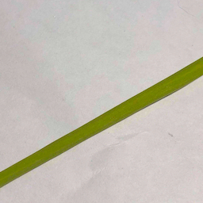
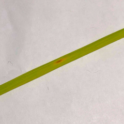
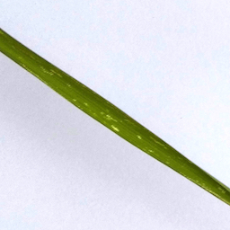
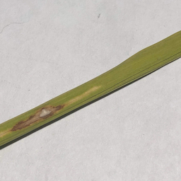

# bangk!t Final Project Team JKT3-E

  

Rice disease detection using machine learning. The dataset is from [this Kaggle repo](https://www.kaggle.com/minhhuy2810/rice-diseases-image-dataset). We also do improvement to the dataset (moving the wrongly labelled data), you can access it [here](https://drive.google.com/drive/folders/1lbgXCNdc5BICy-MOzRNdfI670TC-BrnL?usp=sharing).

This model already deployed on:
  - Mobile android app: https://play.google.com/store/apps/details?id=dev.mtsstudio.riceye
  - Web: https://riceye.herokuapp.com

[LINK] Riceye Mobile Application repo: https://github.com/hansels/flutter_riceye

[LINK] Riceye Website Application repo: https://github.com/rikeadelia/riceye-webapp

## Disease Images:

## Credit
This project was made for Google Bangk!t program. This project is created by Hansel Susanto, Brizky Ramadhani, and Rike Adelia.
